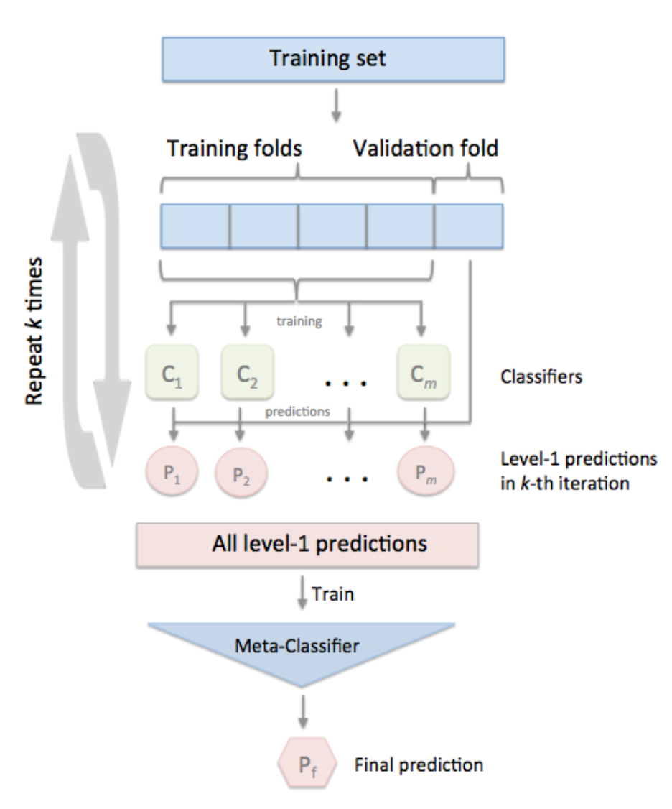

# Automated Sleep Staging Using EEG Signals

## Full Report
For a detailed exploration of our methodologies, results, and discussions, refer to our comprehensive report: [Full Project Report](report.pdf).

## Introduction
This project focuses on automated sleep staging by analyzing EEG signals. Utilizing advanced machine learning techniques, we aim to classify sleep stages accurately, contributing significantly to sleep medicine. Our approach integrates data preprocessing, feature extraction, and ensemble learning to achieve promising results.

## Dataset Description
The dataset comprises EEG and accelerometer records, representing five sleep stages. Our objective is to classify these stages using signal processing and machine learning techniques.

## Methodology
### Pre-processing
- Signal clipping and noise reduction
- Handling class imbalance with stratified sampling

### Feature Extraction
- Time and frequency domain statistical features
- Fractal dimensions and additional features
- Rescaling and dimensionality reduction for optimal performance

### Model Architecture
- Base models: XGBoost, LightGBM, RandomForest, and others
- Meta model: Combining base model predictions for enhanced accuracy
- Cross-validation and post-processing techniques to refine predictions

## Results
Our model achieved an F1 score of 67.5%, demonstrating the efficacy of ensemble learning in automated sleep staging. Detailed performance metrics and comparisons are provided.

## Conclusion
The project illustrates the potential of machine and deep learning in accurately classifying sleep stages from EEG signals, offering insights for further research and practical applications in sleep medicine.

## References
- [Dreem Headband - Beacon Biosignals](https://beacon.bio/dreem-headband/)
- [Sleep Stage Classification Using EEG Signal Analysis: A Comprehensive Survey and New Investigation, Khald Ali I. Aboalayon et al., 2016]([https://...](https://www.mdpi.com/1099-4300/18/9/272))

## Team
- Raphael Romand-Ferroni (raphael.romandferroni@student-cs.fr)
- Clement Simon (clement.simon@student-cs.fr)
